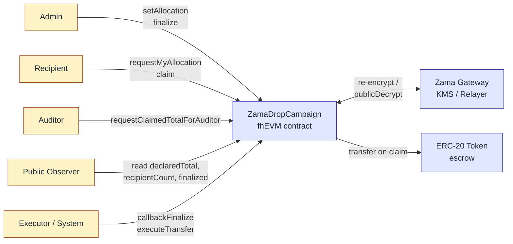

# ZamaDrop

> **Private allocations. Public accountability.**

[](https://soliditylang.org/)
[](https://hardhat.org/)
[](https://docs.zama.ai/fhevm)
[](https://www.zama.ai/)
[](./LICENSE)

🌐 English | [简体中文](./README.zh-CN.md)

---

ZamaDrop is a **confidential token distribution protocol** built on Zama's fhEVM. It lets a project run a fully public airdrop campaign — declared total, recipient count, rules, on-chain status — while keeping every individual recipient's allocation amount encrypted on-chain. Eligibility lists no longer leak balances. The campaign stays auditable; the recipients stay private. Submitted to the Zama Protocol Bounty (Confidential Onchain Finance track).

## The Problem

Every public airdrop today ships a side effect that nobody signed up for: the allocation list itself becomes a high-precision targeting database. Anyone can sort recipients by amount, identify the largest wallets, and turn the result into a phishing list, a social-engineering target list, or a long-term doxxing index. Merkle-tree drops solved *who is eligible* but published *how much they got* alongside it. The privacy gap is structural, not incidental — it scales with every successful launch.

## The Solution

ZamaDrop uses Zama's Fully Homomorphic Encryption to decouple the two layers that have always been bundled together. The campaign-level facts (declared total, recipient count, finalize state, claim progress) stay fully public and verifiable. The per-recipient allocation amounts live on-chain as `euint64` ciphertexts that only the recipient can decrypt. The contract still checks the total-supply invariant — `sum(allocations) == declaredTotal` — entirely under encryption, so the operator cannot quietly under-fund the campaign. Compliance is preserved through a designated auditor role that can decrypt aggregate metrics (claimed total) but never any individual amount.

## Architecture



Five capabilities, four user roles plus one system layer:

- **Admin** declares the total, sets each encrypted allocation, and triggers `finalize`.
- **Recipient** decrypts their own allocation in the browser via re-encryption, then `claim`s.
- **Auditor** decrypts aggregate `claimedTotal` for compliance reporting — never per-recipient amounts.
- **Public** reads campaign metadata and finalize state without any wallet.
- **Executor (System)** is an off-chain settlement layer that consumes `finalizeCheckHandle` and `pendingClaimHandle` ciphertexts via Gateway public-decryption, then calls `callbackFinalize` and `executeTransfer`. Today this is a trusted MVP role; see [Security Model](#security-model).

## Live Deployment (Sepolia)

The latest deployment lives on Ethereum Sepolia testnet. Source of truth: [`deployments/sepolia.json`](./deployments/sepolia.json).

| Contract | Address | Explorer |
|---|---|---|
| `MockToken` (ZDT) | `0xE8d42a29c5f796A5E45f4806BB28205EC387A68C` | [Etherscan](https://sepolia.etherscan.io/address/0xE8d42a29c5f796A5E45f4806BB28205EC387A68C) |
| `ZamaDropCampaign` | `0x30Af9a636B0284338B5D6CB1DE5DaE3407B6Ed93` | [Etherscan](https://sepolia.etherscan.io/address/0x30Af9a636B0284338B5D6CB1DE5DaE3407B6Ed93) |

Campaign parameters: `declaredTotal = 1000`, `recipientCount = 2`, token decimals `0`. End-to-end flow has been validated on Sepolia (six on-chain transactions, KMS public decryption confirmed in 30–60 s).

## Contract Interface

| Function | Caller | Purpose |
|---|---|---|
| `setAllocation(address, externalEuint64, bytes)` | Admin | Append-only: assign one recipient's encrypted allocation; running total accumulates under FHE. |
| `finalize()` | Admin | Compute `FHE.eq(runningTotal, declaredTotal)` and publish the `ebool` handle for public decryption. |
| `callbackFinalize(bool)` | Executor | Write the decrypted check result back; flips `finalized = true` on success. |
| `requestMyAllocation()` | Recipient | Returns the recipient's encrypted allocation handle for browser-side re-encryption. |
| `claim()` | Recipient | Atomic check-then-set: marks claimed, accumulates `claimedTotal` under FHE, exposes per-claim handle. |
| `executeTransfer(address, uint64)` | Executor | Settles the actual ERC-20 transfer after the per-claim handle has been decrypted. |
| `requestClaimedTotalForAuditor()` | Auditor | Returns the aggregate `claimedTotal` ciphertext handle. |

Public storage (`declaredTotal`, `recipientCount`, `finalized`, `allocationSet`, `claimed`, `transferred`, etc.) is readable by anyone.

## Local Development

Requires Node.js ≥ 20.

### Smart contracts

```bash
npm install
npm run compile        # compile contracts
npm test               # run Hardhat tests against the fhEVM mock
npm run lint           # ESLint over .ts and .sol
```

### Frontend

```bash
cd frontend
npm install
npm run dev            # Vite dev server on http://localhost:5173
```

The frontend wires four role-specific tabs — Public, Admin, Recipient, Auditor — to the deployed Sepolia contracts. Configure addresses via `frontend/.env` (see `.env.e2e.example`). Wallet integration uses wagmi + viem; FHE operations go through `@zama-fhe/relayer-sdk`.

## Testing

### Hardhat unit tests

The full test suite runs against the fhEVM mock — no testnet, no Gateway latency. Coverage includes the state machine, allocation append-only enforcement, claim atomicity, ACL boundaries, and the explicit MVP trust-assumption tests for `callbackFinalize` and `executeTransfer`.

```bash
npm test               # 25 passing
npm run coverage
```

### Frontend end-to-end (Playwright + Synpress)

Real-MetaMask E2E uses [Synpress](https://github.com/Synthetixio/synpress) for wallet automation. Cache a wallet first, then run the regression suites.

```bash
cd frontend
npm run e2e:wallet-cache             # build a fresh wallet cache (one-time)
npm run e2e:wallet-cache:connected   # variant: pre-connected to dApp
npm run e2e:wallet-regression        # MM1–MM4: connect, recipient decrypt, auditor decrypt, reject-and-retry
npm run e2e:ui-regression            # no-wallet UI smoke tests (role boundaries)
npm run e2e:ui                       # interactive Playwright UI
```

See [`docs/metamask-automation-plan.md`](./docs/metamask-automation-plan.md) for the full strategy and [`docs/role-boundary-test-strategy.md`](./docs/role-boundary-test-strategy.md) for the layered test plan.

## Project Structure

```
zamaDrop/
├── contracts/              # ZamaDropCampaign.sol + MockToken.sol
├── deploy/                 # hardhat-deploy scripts
├── deployments/            # network deployment manifests (sepolia.json)
├── docs/                   # PRD, role protocol, test plans, landing-page spec
├── frontend/               # Vite + React + wagmi + relayer-sdk
│   ├── src/                # Tabs: Public / Admin / Recipient / Auditor
│   └── e2e/                # Playwright + Synpress specs and fixtures
├── openspec/               # spec-driven change proposals
├── scripts/                # operational scripts (e.g. e2e-sepolia.ts)
└── test/                   # Hardhat + fhEVM mock unit tests
```

## Security Model

ZamaDrop v0.x is a hackathon-stage MVP and ships with two explicit trust assumptions:

1. **`callbackFinalize(bool)` accepts any caller.** A production deployment must verify a Zama KMS signature over the public-decryption result before flipping `finalized`. The current contract documents this as MVP-acceptable and the unit tests pin the behavior.
2. **`executeTransfer(address, uint64)` accepts any caller.** A production deployment must either (a) verify a KMS signature binding the supplied `amount` to `pendingClaimHandle[user]`, or (b) restrict the function to a dedicated `executor` role.

The encryption-side guarantees are real: per-recipient allocations are strictly ACL-gated, `runningTotal` is verified against `declaredTotal` purely under FHE, and `claimedTotal` is decryptable only by the auditor. The trust delegation lives entirely at the off-chain settlement boundary. Full write-up: [`docs/trust-model.md`](./docs/trust-model.md).

## Roadmap

- **v0.x (now):** four-role MVP, Sepolia validated, real-MetaMask E2E coverage.
- **v1:** KMS signature verification on `callbackFinalize` and `executeTransfer`; dedicated `executor` role; auditor multisig; Merkle eligibility integration so ZamaDrop layers cleanly on top of existing Merkle-based airdrop tooling.
- **Beyond:** campaign factory for multi-drop deployments, vesting curves, ERC-7984 confidential-transfer integration, contributor-grant and DAO-payroll templates that reuse the same primitives.

## Demo Video

[2-minute demo video coming soon]

## Documentation

- [`docs/prd.md`](./docs/prd.md) — Product requirements (Chinese)
- [`docs/prd.en.md`](./docs/prd.en.md) — Product requirements (English)
- [`docs/trust-model.md`](./docs/trust-model.md) — MVP trust assumptions and v1 hardening plan
- [`docs/role-page-protocol.md`](./docs/role-page-protocol.md) — Five-layer role model and frontend page protocol
- [`docs/metamask-automation-plan.md`](./docs/metamask-automation-plan.md) — Synpress + Playwright wallet automation
- [`docs/landing-page-spec.md`](./docs/landing-page-spec.md) — Landing page v2 visual specification

## Contributing

Issues and PRs are welcome. Please:

1. Open an issue first for non-trivial changes so we can align on scope.
2. Run `npm run lint && npm test` before submitting.
3. Keep commits Conventional-Commits-style (`feat:`, `fix:`, `docs:`, …).
4. AI-assisted contributions are fine — see [`AGENTS.md`](./AGENTS.md) for project conventions used by Claude / Codex / Gemini agents.

## License

[MIT](./LICENSE) © ZamaDrop Contributors

## Acknowledgments

- [**Zama**](https://www.zama.ai/) for the Protocol Bounty and the fhEVM stack.
- [`@fhevm/solidity`](https://www.npmjs.com/package/@fhevm/solidity) — FHE primitives in Solidity.
- [`@zama-fhe/relayer-sdk`](https://www.npmjs.com/package/@zama-fhe/relayer-sdk) — browser-side encryption, re-encryption, and Gateway interaction.
- [OpenZeppelin Contracts](https://github.com/OpenZeppelin/openzeppelin-contracts) — battle-tested ERC-20 base for the test token.
