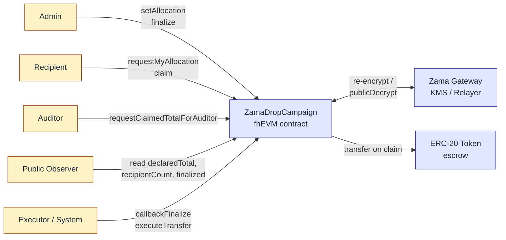

# ZamaDrop

> **Private allocations. Public accountability.**

[](https://soliditylang.org/)
[](https://hardhat.org/)
[](https://docs.zama.ai/fhevm)
[](https://www.zama.ai/)
[](./LICENSE)

🌐 English | [简体中文](./README.zh-CN.md)

---

ZamaDrop is a **confidential token distribution protocol** built on Zama's fhEVM. It lets a project run a fully public airdrop campaign — declared total, recipient count, rules, on-chain status — while keeping every individual recipient's allocation amount encrypted on-chain. Eligibility lists no longer leak balances. The campaign stays auditable; the recipients stay private. Submitted to the Zama Protocol Bounty (Confidential Onchain Finance track).

## The Problem

Every public airdrop today ships a side effect that nobody signed up for: the allocation list itself becomes a high-precision targeting database. Anyone can sort recipients by amount, identify the largest wallets, and turn the result into a phishing list, a social-engineering target list, or a long-term doxxing index. Merkle-tree drops solved *who is eligible* but published *how much they got* alongside it. The privacy gap is structural, not incidental — it scales with every successful launch.

## The Solution

ZamaDrop uses Zama's Fully Homomorphic Encryption to decouple the two layers that have always been bundled together. The campaign-level facts (declared total, recipient count, finalize state, claim progress) stay fully public and verifiable. The per-recipient allocation amounts live on-chain as `euint64` ciphertexts that only the recipient can decrypt. The contract still checks the total-supply invariant — `sum(allocations) == declaredTotal` — entirely under encryption, so the operator cannot quietly under-fund the campaign. Compliance is preserved through a designated auditor role that can decrypt aggregate metrics (claimed total) but never any individual amount.

## Architecture



Five capabilities, four user roles plus one system layer:

- **Admin** declares the total, sets each encrypted allocation, and triggers `finalize`.
- **Recipient** decrypts their own allocation in the browser via re-encryption, then `claim`s.
- **Auditor** decrypts aggregate `claimedTotal` for compliance reporting — never per-recipient amounts.
- **Public** reads campaign metadata and finalize state without any wallet.
- **Executor (System)** is an off-chain settlement layer that consumes `finalizeCheckHandle` and `pendingClaimHandle` ciphertexts via Gateway public-decryption, then calls `callbackFinalize` and `executeTransfer`. The contract verifies KMS threshold signatures via `FHE.checkSignatures` before mutating state, so the executor is **not** a privileged role — any account can run `scripts/executor.ts`. See [Security Model](#security-model).

## Live Deployment (Sepolia)

The latest deployment lives on Ethereum Sepolia testnet. Source of truth: [`deployments/sepolia.json`](./deployments/sepolia.json). The current build is **KMS-hardened** — `callbackFinalize` and `executeTransfer` both verify Zama threshold KMS signatures via `FHE.checkSignatures` before mutating state, closing the integrity gap that was documented in earlier MVP releases.

| Contract | Address | Explorer |
|---|---|---|
| `MockToken` (ZDT) | `0x775e867541D348F022B3431209710B5BC02Ad29C` | [Etherscan](https://sepolia.etherscan.io/address/0x775e867541D348F022B3431209710B5BC02Ad29C) |
| `ZamaDropCampaign` | `0xDAe72F548BFc37649c7Da24Cd0a2c90a73E6c5c1` | [Etherscan](https://sepolia.etherscan.io/address/0xDAe72F548BFc37649c7Da24Cd0a2c90a73E6c5c1) |

Campaign parameters: `declaredTotal = 1000`, `recipientCount = 2`, token decimals `0`, admin/auditor set to `0x81f19692e5C59a7D7DB7D0689843C213C9BFA260` for the demo deployment. Earlier MVP deployments (without KMS hardening, or with `decimals=18` precision issues) are archived under `previousDeployments` in `deployments/sepolia.json`.

## Contract Interface

| Function | Caller | Purpose |
|---|---|---|
| `setAllocation(address, externalEuint64, bytes)` | Admin | Append-only: assign one recipient's encrypted allocation; running total accumulates under FHE. |
| `finalize()` | Admin | Compute `FHE.eq(runningTotal, declaredTotal)` and publish the `ebool` handle for public decryption. |
| `callbackFinalize(bool result, bytes decryptionProof)` | Anyone (KMS-gated) | Write the decrypted finalize check back; calls `FHE.checkSignatures([finalizeCheckHandle], abi.encode(result), decryptionProof)` before flipping `finalized`. A forged boolean reverts. |
| `requestMyAllocation()` | Recipient | Returns the recipient's encrypted allocation handle for browser-side re-encryption. |
| `claim()` | Recipient | Atomic check-then-set: marks claimed, accumulates `claimedTotal` under FHE, exposes per-claim handle. |
| `executeTransfer(address user, uint64 amount, bytes decryptionProof)` | Anyone (KMS-gated) | Settles the actual ERC-20 transfer; calls `FHE.checkSignatures([pendingClaimHandle[user]], abi.encode(amount), decryptionProof)` before transferring. A mismatched amount reverts. |
| `requestClaimedTotalForAuditor()` | Auditor | Returns the aggregate `claimedTotal` ciphertext handle. |

Public storage (`declaredTotal`, `recipientCount`, `finalized`, `allocationSet`, `claimed`, `transferred`, etc.) is readable by anyone.

## Local Development

Requires Node.js ≥ 20.

### Smart contracts

```bash
npm install
npm run compile        # compile contracts
npm test               # run Hardhat tests against the fhEVM mock
npm run lint           # ESLint over .ts and .sol
```

### Frontend

```bash
cd frontend
npm install
npm run dev            # Vite dev server on http://localhost:5173
```

The frontend is a React Router 7 app composed around a single `CampaignLayout` (`frontend/src/pages/CampaignLayout.tsx`) with four capability tabs — `Overview`, `Admin`, `Recipient`, `Auditor` — routed under `/campaign/:address/{,admin,me,audit}`. All four tabs are always visible; role-gated tabs render an explicit `· active` / `· preview` suffix so a connected wallet can immediately see which capabilities it holds (see [`docs/role-page-protocol.md`](./docs/role-page-protocol.md) for the V6 information architecture). Configure addresses via `frontend/.env` (see `frontend/.env.example`); when unset, `frontend/src/config.ts` falls back to the deployment in `deployments/sepolia.json`. Wallet integration uses wagmi + viem; FHE operations go through `@zama-fhe/relayer-sdk`. UI components are built on shadcn/ui (Tailwind v4) and re-use design tokens from the landing-page repo via `frontend/src/styles/{tokens,effects}.css`.

### Executor (off-chain settlement)

`scripts/executor.ts` is a Node daemon that closes the FHE settlement loop: it polls the campaign every 8 s, calls `publicDecrypt` against the Zama Gateway whenever a `FinalizeRequested` or `ClaimRequested` event surfaces a handle, then submits `callbackFinalize(bool, decryptionProof)` or `executeTransfer(user, amount, decryptionProof)`. It is **not** a privileged role — the trust root is the KMS signature, and the on-chain flags (`finalized`, `transferred[user]`) make the daemon idempotent under parallel runs.

```bash
bun run executor          # Sepolia
bun run executor:local    # local fhevm hardhat network
```

Operational helpers: `scripts/verify-roles.ts` (sanity-check admin/auditor + recent allocation events), `scripts/verify-decrypts.ts` (replay public decryption against a deployed campaign), `scripts/cli-setup.ts` (E2E driver for fresh deployments).

## Testing

### Hardhat unit tests

The full test suite runs against the fhEVM mock — no testnet, no Gateway latency. Coverage includes the state machine, allocation append-only enforcement, claim atomicity, ACL boundaries, and (now post-hardening) the KMS-signature integrity tests — including the dedicated case "amount 与 KMS 解密结果不一致时应 revert（防伪造）" which proves `executeTransfer` cannot be tricked into paying a forged amount.

```bash
npm test               # 26 passing
npm run coverage
```

### Frontend end-to-end (Playwright + Synpress)

Real-MetaMask E2E uses [Synpress](https://github.com/Synthetixio/synpress) for wallet automation. Cache a wallet first, then run the regression suites.

```bash
cd frontend
npm run e2e:wallet-cache             # build a fresh wallet cache (one-time)
npm run e2e:wallet-cache:connected   # variant: pre-connected to dApp
npm run e2e:wallet-regression        # MM1–MM4: connect, recipient decrypt, auditor decrypt, reject-and-retry
npm run e2e:ui-regression            # no-wallet UI smoke tests (role boundaries)
npm run e2e:ui                       # interactive Playwright UI
```

See [`docs/metamask-automation-plan.md`](./docs/metamask-automation-plan.md) for the full strategy and [`docs/role-boundary-test-strategy.md`](./docs/role-boundary-test-strategy.md) for the layered test plan.

## Project Structure

```
zamaDrop/
├── contracts/              # ZamaDropCampaign.sol + MockToken.sol
├── deploy/                 # hardhat-deploy scripts
├── deployments/            # network deployment manifests (sepolia.json — current + previous)
├── docs/                   # PRD, security/trust model, role protocol, PROGRESS, landing-page spec
├── frontend/               # Vite + React Router 7 + wagmi + relayer-sdk + Tailwind v4
│   ├── src/
│   │   ├── pages/
│   │   │   ├── PublicHome.tsx, CampaignLayout.tsx, CampaignOverview.tsx
│   │   │   ├── admin/      # AdminPage + SetAllocationForm + AllocationLedger + FinalizePanel
│   │   │   ├── recipient/  # RecipientPage + AllocationCard + ClaimStepper + BalancePanel
│   │   │   └── auditor/    # AuditorPage + AggregateCard + ComplianceCard + ClaimsActivity
│   │   ├── components/     # CampaignCard, CapabilityStrip, TopBar, ui/* (shadcn primitives)
│   │   ├── hooks/          # useCampaignReads, useTokenMeta, useCampaignEvents, useUserDecryptEuint64
│   │   └── styles/         # tokens.css + effects.css (shared with secret-drop landing repo)
├── openspec/               # spec-driven change proposals (005-frontend marked SUPERSEDED)
├── scripts/                # executor.ts (settlement daemon), verify-roles, verify-decrypts, cli-setup, e2e-sepolia
└── test/                   # Hardhat + fhEVM mock unit tests (26 passing)
```

## Security Model

ZamaDrop validates settlement integrity via Zama's threshold KMS signatures on-chain.

- **`callbackFinalize(bool, bytes decryptionProof)`** calls `FHE.checkSignatures` before flipping `finalized`. Any account may submit the result — the trust root is the KMS signature, not the caller's identity. A forged boolean reverts.
- **`executeTransfer(address, uint64, bytes decryptionProof)`** calls `FHE.checkSignatures` binding `amount` to `pendingClaimHandle[user]` before transferring. A mismatched amount reverts.

The encryption-side guarantees are unchanged: per-recipient allocations are strictly ACL-gated, `runningTotal` is verified against `declaredTotal` purely under FHE, and `claimedTotal` is decryptable only by the auditor. Full write-up: [`docs/SECURITY.md`](./docs/SECURITY.md).

## Roadmap

- **v0.x (now):** four-role MVP with KMS-hardened settlement, Sepolia validated, off-chain executor daemon shipped, real-MetaMask E2E coverage.
- **v1:** auditor multisig, Merkle eligibility integration so ZamaDrop layers cleanly on top of existing Merkle-based airdrop tooling, separate admin/auditor wallets in production deployments, hosted executor with metrics + alerting.
- **Beyond:** campaign factory for multi-drop deployments, vesting curves, ERC-7984 confidential-transfer integration, contributor-grant and DAO-payroll templates that reuse the same primitives.

## Demo Video

[2-minute demo video coming soon]

## Documentation

- [`docs/prd.md`](./docs/prd.md) — Product requirements (Chinese)
- [`docs/prd.en.md`](./docs/prd.en.md) — Product requirements (English)
- [`docs/SECURITY.md`](./docs/SECURITY.md) — Trust model, threat analysis, KMS verification, v1 hardening roadmap
- [`docs/role-page-protocol.md`](./docs/role-page-protocol.md) — Five-layer role model and V6 capability-tab frontend protocol
- [`docs/deploy.md`](./docs/deploy.md) — Sepolia deployment guide
- [`docs/metamask-automation-plan.md`](./docs/metamask-automation-plan.md) — Synpress + Playwright wallet automation

## Contributing

Issues and PRs are welcome. Please:

1. Open an issue first for non-trivial changes so we can align on scope.
2. Run `npm run lint && npm test` before submitting.
3. Keep commits Conventional-Commits-style (`feat:`, `fix:`, `docs:`, …).
4. AI-assisted contributions are fine — see [`AGENTS.md`](./AGENTS.md) for project conventions used by Claude / Codex / Gemini agents.

## License

[MIT](./LICENSE) © ZamaDrop Contributors

## Acknowledgments

- [**Zama**](https://www.zama.ai/) for the Protocol Bounty and the fhEVM stack.
- [`@fhevm/solidity`](https://www.npmjs.com/package/@fhevm/solidity) — FHE primitives in Solidity.
- [`@zama-fhe/relayer-sdk`](https://www.npmjs.com/package/@zama-fhe/relayer-sdk) — browser-side encryption, re-encryption, and Gateway interaction.
- [OpenZeppelin Contracts](https://github.com/OpenZeppelin/openzeppelin-contracts) — battle-tested ERC-20 base for the test token.
