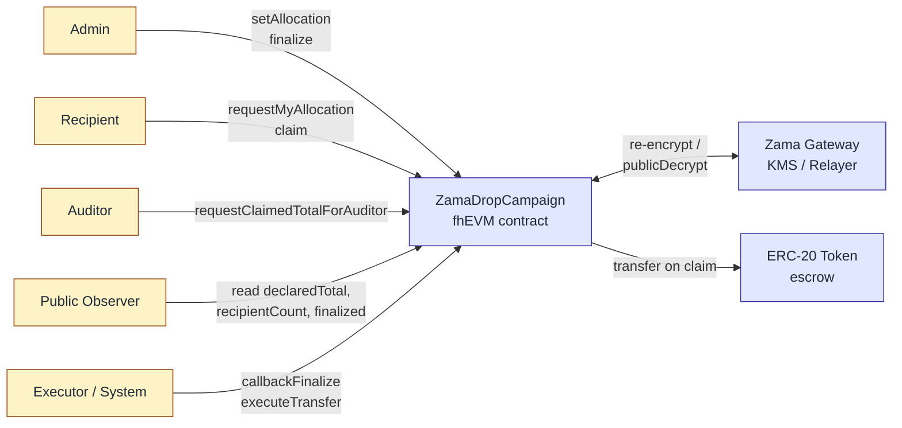

# ZamaDrop

> **Private allocations. Public accountability.**

[](https://soliditylang.org/)
[](https://hardhat.org/)
[](https://docs.zama.ai/fhevm)
[](https://www.zama.ai/)
[](./LICENSE)

🌐 [English](./README.md) | 简体中文

---

ZamaDrop 是基于 Zama fhEVM 的机密**分配金额**分发协议。每个分配金额在 setAllocation 阶段以 FHE 密文形式上链，并在密文域内累加校验总额；在 claim 时金额随 ERC-20 转账变为明文。Campaign 级事实（声明总量、受益人数、finalize 状态、领取进度）保持完全公开可验证。**接收者的成员身份在 V7 设计上是链上公开的**——资格列表不再泄露金额，但接收者集合本身可由合约事件枚举。完整隐私边界见 [`docs/SECURITY.md`](./docs/SECURITY.md#v7-privacy-boundary)。本项目提交至 Zama Protocol Bounty（Confidential Onchain Finance 赛道）。

## 问题

今天的每一次公开空投都附带了没人愿意接受的副作用——allocation 列表本身就是一份高精度的目标定位数据库。任何人都能按金额排序、识别大额钱包，把结果变成钓鱼名单、社工目标清单或长期 doxxing 索引。Merkle 空投解决了"谁有资格"，但同时把"领多少"也一并公开。这个隐私缺口是结构性的，不是偶然的——每一次成功的 launch 都会让它扩大。

## 解决方案

ZamaDrop 用 Zama 的全同态加密把这两层一直被绑在一起的设计解耦。campaign 级别的事实（声明总量、受益人数、finalize 状态、领取进度）保持完全公开可验证。每个受益人的 allocation 金额在链上以 `euint64` 密文形式存在，只有受益人本人能解密。合约仍然在密文状态下校验总量约束 —— `sum(allocations) == declaredTotal` —— 项目方无法在密文掩护下偷偷克扣总额。合规性通过指定的 auditor 角色保留：auditor 能解密聚合指标（已 claim 总额），但永远看不到任何个人 allocation。

## 架构



五类能力，四个用户角色加一个系统执行层：

- **Admin** 声明总量、为每个受益人设置加密 allocation、触发 `finalize`。
- **Recipient** 在浏览器端通过 re-encryption 解密自己的 allocation，然后 `claim`。
- **Auditor** 解密聚合的 `claimedTotal` 用于合规报告——永远看不到任何单笔金额。
- **Public** 不需要钱包即可读取 campaign 元数据与 finalize 状态。
- **Executor (System)** 是链下结算层，消费 `finalizeCheckHandle` 与 `pendingClaimHandle` 密文（通过 Gateway 公开解密），然后调用 `callbackFinalize` 与 `executeTransfer`。合约通过 `FHE.checkSignatures` 在改写状态前校验 KMS threshold 签名，因此 executor **不是**特权角色——任何账户都可以跑 `scripts/executor.ts`。详见 [Security Model](#security-model)。

## Live Deployment (Sepolia)

最新部署位于 Ethereum Sepolia 测试网。事实来源：[`deployments/sepolia.json`](./deployments/sepolia.json)。当前版本 **已完成 KMS 加固** —— `callbackFinalize` 与 `executeTransfer` 都通过 `FHE.checkSignatures` 校验 Zama threshold KMS 签名后才会改写状态，关闭了之前 MVP 版本里记录在案的完整性 gap。

| 合约 | 地址 | 浏览器 |
|---|---|---|
| `MockToken` (ZDT) | `0x775e867541D348F022B3431209710B5BC02Ad29C` | [Etherscan](https://sepolia.etherscan.io/address/0x775e867541D348F022B3431209710B5BC02Ad29C) |
| `ZamaDropCampaign` | `0xDAe72F548BFc37649c7Da24Cd0a2c90a73E6c5c1` | [Etherscan](https://sepolia.etherscan.io/address/0xDAe72F548BFc37649c7Da24Cd0a2c90a73E6c5c1) |

Campaign 参数：`declaredTotal = 1000`，`recipientCount = 2`，token decimals 为 `0`，admin / auditor 在 demo 部署中均设置为 `0x81f19692e5C59a7D7DB7D0689843C213C9BFA260`。早期 MVP 部署（未加固，或 `decimals=18` 精度问题）归档在 `deployments/sepolia.json` 的 `previousDeployments` 字段下。

## Contract Interface

| 函数 | 调用者 | 用途 |
|---|---|---|
| `setAllocation(address, externalEuint64, bytes)` | Admin | 仅追加：为某个受益人写入加密 allocation；runningTotal 在 FHE 下累加。 |
| `finalize()` | Admin | 计算 `FHE.eq(runningTotal, declaredTotal)`，把 `ebool` handle 暴露给链下公开解密。 |
| `callbackFinalize(bool result, bytes decryptionProof)` | 任何人（KMS 把关） | 把解密结果回写合约；先调 `FHE.checkSignatures([finalizeCheckHandle], abi.encode(result), decryptionProof)` 校验 KMS threshold 签名，校验通过才翻 `finalized`；伪造的 bool 会 revert。 |
| `requestMyAllocation()` | Recipient | 返回受益人 allocation 的密文 handle，用于浏览器端 re-encryption。 |
| `claim()` | Recipient | 原子的 check-then-set：标记已领取、在 FHE 下累加 `claimedTotal`、暴露 per-claim handle。 |
| `executeTransfer(address user, uint64 amount, bytes decryptionProof)` | 任何人（KMS 把关） | 先调 `FHE.checkSignatures([pendingClaimHandle[user]], abi.encode(amount), decryptionProof)` 把 amount 与密文绑定，校验通过才执行 ERC-20 转账；伪造金额会 revert。 |
| `requestClaimedTotalForAuditor()` | Auditor | 返回聚合 `claimedTotal` 的密文 handle。 |

公开存储字段（`declaredTotal`, `recipientCount`, `finalized`, `allocationSet`, `claimed`, `transferred` 等）任何人可读。

## Local Development

需要 Node.js ≥ 20。

### Smart contracts

```bash
npm install
npm run compile        # 编译合约
npm test               # 在 fhEVM mock 上运行 Hardhat 测试
npm run lint           # 对 .ts 与 .sol 跑 ESLint
```

### Frontend

```bash
cd frontend
npm install
npm run dev            # Vite dev server: http://localhost:5173
```

前端是 React Router 7 应用，整个 dApp 的入口围绕单一 `CampaignLayout` (`frontend/src/pages/CampaignLayout.tsx`)，下挂四个能力 tab —— `Overview` / `Admin` / `Recipient` / `Auditor`，路由形如 `/campaign/:address/{,admin,me,audit}`。**所有 4 个 tab 始终可见**；带角色门槛的 tab 会附带 `· active` / `· preview` 后缀，让钱包一连上就能看出当前持有哪些能力（V6 信息架构详见 [`docs/role-page-protocol.md`](./docs/role-page-protocol.md)）。地址通过 `frontend/.env` 配置（参考 `frontend/.env.example`）；如未设置，`frontend/src/config.ts` 会回退到 `deployments/sepolia.json` 中的部署地址。钱包用 wagmi + viem，FHE 操作走 `@zama-fhe/relayer-sdk`。UI 基于 shadcn/ui (Tailwind v4)，并通过 `frontend/src/styles/{tokens,effects}.css` 复用 landing page 仓库的设计 token。

### Executor（链下结算）

`scripts/executor.ts` 是把 FHE 结算闭环跑起来的 Node 守护进程：每 8 秒轮询合约，监听 `FinalizeRequested` / `ClaimRequested` 事件，从 Zama Gateway 拉到 `publicDecrypt` 的明文 + KMS 签名后，再调 `callbackFinalize(bool, decryptionProof)` 或 `executeTransfer(user, amount, decryptionProof)`。它**不是**特权角色——信任根是 KMS 签名，而不是 executor 身份；多实例并发也安全，靠链上 `finalized` / `transferred[user]` 去重。

```bash
bun run executor          # Sepolia
bun run executor:local    # 本地 fhevm hardhat 网络
```

运维辅助脚本：`scripts/verify-roles.ts`（核对 admin / auditor + 最近 allocation 事件），`scripts/verify-decrypts.ts`（针对已部署合约重放公开解密），`scripts/cli-setup.ts`（fresh 部署的 E2E 驱动）。

## Testing

### Hardhat 单元测试

完整测试套件在 fhEVM mock 上跑——没有测试网，没有 Gateway 延迟。覆盖状态机、allocation 仅追加约束、claim 原子性、ACL 边界，以及（KMS 加固后）`callbackFinalize` / `executeTransfer` 的 KMS 签名校验测试——其中包含专门的 "amount 与 KMS 解密结果不一致时应 revert（防伪造）" 用例，证明 `executeTransfer` 无法被伪造金额骗过。

```bash
npm test               # 26 passing
npm run coverage
```

### Frontend 端到端测试 (Playwright + Synpress)

真实 MetaMask E2E 用 [Synpress](https://github.com/Synthetixio/synpress) 实现钱包自动化。先生成 wallet cache，然后跑回归套件。

```bash
cd frontend
npm run e2e:wallet-cache             # 一次性：生成全新 wallet cache
npm run e2e:wallet-cache:connected   # 变体：预连接 dApp
npm run e2e:wallet-regression        # MM1–MM4：connect / recipient 解密 / auditor 解密 / 拒签重试
npm run e2e:ui-regression            # 无钱包 UI 冒烟（角色边界）
npm run e2e:ui                       # 交互式 Playwright UI
```

完整测试策略见 [`test/TEST_PLAN.md`](./test/TEST_PLAN.md)，覆盖 Hardhat 用例、无钱包 UI 冒烟以及 Synpress + Playwright 钱包 E2E 方案。

## Project Structure

```
zamaDrop/
├── contracts/              # ZamaDropCampaign.sol + MockToken.sol
├── deploy/                 # hardhat-deploy 部署脚本
├── deployments/            # 各网络部署清单 (sepolia.json — 当前 + 历史归档)
├── docs/                   # PRD、security/trust model、role protocol、PROGRESS、landing page 规范
├── frontend/               # Vite + React Router 7 + wagmi + relayer-sdk + Tailwind v4
│   ├── src/
│   │   ├── pages/
│   │   │   ├── PublicHome.tsx, CampaignLayout.tsx, CampaignOverview.tsx
│   │   │   ├── admin/      # AdminPage + SetAllocationForm + AllocationLedger + FinalizePanel
│   │   │   ├── recipient/  # RecipientPage + AllocationCard + ClaimStepper + BalancePanel
│   │   │   └── auditor/    # AuditorPage + AggregateCard + ComplianceCard + ClaimsActivity
│   │   ├── components/     # CampaignCard, CapabilityStrip, TopBar, ui/* (shadcn primitives)
│   │   ├── hooks/          # useCampaignReads, useTokenMeta, useCampaignEvents, useUserDecryptEuint64
│   │   └── styles/         # tokens.css + effects.css（与 secret-drop landing 仓库共享）
├── openspec/               # 规范驱动的变更提案（005-frontend 已标记 SUPERSEDED）
├── scripts/                # executor.ts（结算守护进程）、verify-roles、verify-decrypts、cli-setup、e2e-sepolia
└── test/                   # Hardhat + fhEVM mock 单元测试（26 passing）
```

## Security Model

ZamaDrop 通过 Zama threshold KMS 的签名在链上校验结算完整性，**不**依赖任何账户的诚实性。

- **`callbackFinalize(bool, bytes decryptionProof)`** 在翻 `finalized` 之前调 `FHE.checkSignatures`。任何账户都可以提交结果——信任根是 KMS 签名，不是调用者身份。伪造的 bool 直接 revert。
- **`executeTransfer(address, uint64, bytes decryptionProof)`** 在转账前调 `FHE.checkSignatures` 把 `amount` 与 `pendingClaimHandle[user]` 绑定。金额对不上就 revert。

加密侧的保证保持不变：每个受益人的 allocation 严格按 ACL 隔离，`runningTotal` 与 `declaredTotal` 完全在 FHE 下校验，`claimedTotal` 仅 auditor 可解密。完整说明：[`docs/SECURITY.md`](./docs/SECURITY.md)。

## Roadmap

- **v0.x (当前)：** 四角色 MVP，KMS 加固结算已上线，Sepolia 已验证，链下 executor 守护进程已就位，真实 MetaMask E2E 覆盖。
- **v1：** auditor 多签；Merkle 资格集成，使 ZamaDrop 干净地叠加在现有 Merkle 空投工具链之上；生产部署中分离 admin / auditor 钱包；带指标 + 告警的托管版 executor。
- **更远：** 多 campaign factory、vesting 曲线、ERC-7984 机密转账集成、复用同一组原语的 contributor grant 与 DAO payroll 模板。

## Demo Video

[2 分钟 demo 视频敬请期待]

## Documentation

- [`docs/product/prd.zh-CN.md`](./docs/product/prd.zh-CN.md) —— 产品需求文档（中文）
- [`docs/product/prd.en.md`](./docs/product/prd.en.md) —— 产品需求文档（英文）
- [`docs/SECURITY.md`](./docs/SECURITY.md) —— 信任模型、威胁分析、KMS 校验、v1 加固路线
- [`docs/role-page-protocol.md`](./docs/role-page-protocol.md) —— 五层角色模型与 V6 能力 tab 前端协议
- [`docs/RUNBOOKS/sepolia-deploy.md`](./docs/RUNBOOKS/sepolia-deploy.md) —— Sepolia 部署 runbook
- [`test/TEST_PLAN.md`](./test/TEST_PLAN.md) —— 完整测试策略（Hardhat、无钱包 UI 冒烟、Synpress + Playwright 钱包 E2E）

## Contributing

欢迎 issue 和 PR。请：

1. 非 trivial 变更先开 issue 对齐 scope。
2. 提交前跑 `npm run lint && npm test`。
3. commit 遵循 Conventional Commits（`feat:`, `fix:`, `docs:`, …）。
4. 欢迎 AI 协作贡献——参见 [`AGENTS.md`](./AGENTS.md) 了解 Claude / Codex / Gemini 等 agent 使用的项目约定。

## License

[MIT](./LICENSE) © ZamaDrop Contributors

## Acknowledgments

- [**Zama**](https://www.zama.ai/) —— 提供 Protocol Bounty 与 fhEVM 技术栈。
- [`@fhevm/solidity`](https://www.npmjs.com/package/@fhevm/solidity) —— Solidity 中的 FHE 原语。
- [`@zama-fhe/relayer-sdk`](https://www.npmjs.com/package/@zama-fhe/relayer-sdk) —— 浏览器端加密、re-encryption 与 Gateway 交互。
- [OpenZeppelin Contracts](https://github.com/OpenZeppelin/openzeppelin-contracts) —— 测试代币所用的成熟 ERC-20 基础合约。
