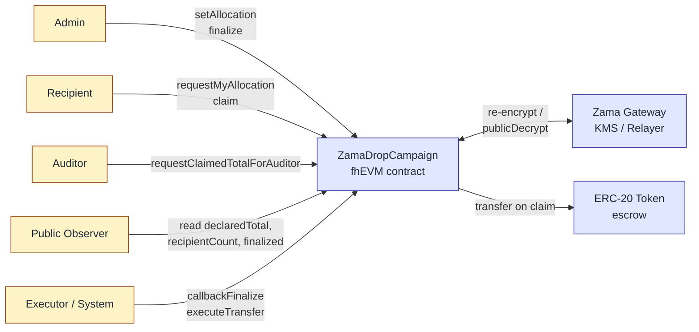

# ZamaDrop

> **Private allocations. Public accountability.**

[](https://soliditylang.org/)
[](https://hardhat.org/)
[](https://docs.zama.ai/fhevm)
[](https://www.zama.ai/)
[](./LICENSE)

🌐 [English](./README.md) | 简体中文

---

ZamaDrop 是一个基于 Zama fhEVM 的**机密代币分发协议**。它让项目方在 Web3 公开空投中，把 campaign 总量、人数、规则、链上状态全部公开可验证，同时把每个受益人的具体 allocation 金额加密存储于链上。资格列表不再泄露金额，campaign 仍然可审计，受益人仍然保有隐私。本项目提交至 Zama Protocol Bounty（Confidential Onchain Finance 赛道）。

## 问题

今天的每一次公开空投都附带了没人愿意接受的副作用——allocation 列表本身就是一份高精度的目标定位数据库。任何人都能按金额排序、识别大额钱包，把结果变成钓鱼名单、社工目标清单或长期 doxxing 索引。Merkle 空投解决了"谁有资格"，但同时把"领多少"也一并公开。这个隐私缺口是结构性的，不是偶然的——每一次成功的 launch 都会让它扩大。

## 解决方案

ZamaDrop 用 Zama 的全同态加密把这两层一直被绑在一起的设计解耦。campaign 级别的事实（声明总量、受益人数、finalize 状态、领取进度）保持完全公开可验证。每个受益人的 allocation 金额在链上以 `euint64` 密文形式存在，只有受益人本人能解密。合约仍然在密文状态下校验总量约束 —— `sum(allocations) == declaredTotal` —— 项目方无法在密文掩护下偷偷克扣总额。合规性通过指定的 auditor 角色保留：auditor 能解密聚合指标（已 claim 总额），但永远看不到任何个人 allocation。

## 架构



五类能力，四个用户角色加一个系统执行层：

- **Admin** 声明总量、为每个受益人设置加密 allocation、触发 `finalize`。
- **Recipient** 在浏览器端通过 re-encryption 解密自己的 allocation，然后 `claim`。
- **Auditor** 解密聚合的 `claimedTotal` 用于合规报告——永远看不到任何单笔金额。
- **Public** 不需要钱包即可读取 campaign 元数据与 finalize 状态。
- **Executor (System)** 是链下结算层，消费 `finalizeCheckHandle` 与 `pendingClaimHandle` 密文（通过 Gateway 公开解密），然后调用 `callbackFinalize` 与 `executeTransfer`。当前是受信 MVP 角色，详见 [Security Model](#security-model)。

## Live Deployment (Sepolia)

最新部署位于 Ethereum Sepolia 测试网。事实来源：[`deployments/sepolia.json`](./deployments/sepolia.json)。

| 合约 | 地址 | 浏览器 |
|---|---|---|
| `MockToken` (ZDT) | `0xE8d42a29c5f796A5E45f4806BB28205EC387A68C` | [Etherscan](https://sepolia.etherscan.io/address/0xE8d42a29c5f796A5E45f4806BB28205EC387A68C) |
| `ZamaDropCampaign` | `0x30Af9a636B0284338B5D6CB1DE5DaE3407B6Ed93` | [Etherscan](https://sepolia.etherscan.io/address/0x30Af9a636B0284338B5D6CB1DE5DaE3407B6Ed93) |

Campaign 参数：`declaredTotal = 1000`，`recipientCount = 2`，token decimals 为 `0`。已在 Sepolia 完整跑通端到端流程（6 笔真实链上交易，KMS 公开解密 30~60 秒确认）。

## Contract Interface

| 函数 | 调用者 | 用途 |
|---|---|---|
| `setAllocation(address, externalEuint64, bytes)` | Admin | 仅追加：为某个受益人写入加密 allocation；runningTotal 在 FHE 下累加。 |
| `finalize()` | Admin | 计算 `FHE.eq(runningTotal, declaredTotal)`，把 `ebool` handle 暴露给链下公开解密。 |
| `callbackFinalize(bool)` | Executor | 把解密结果回写合约；成功时 `finalized = true`。 |
| `requestMyAllocation()` | Recipient | 返回受益人 allocation 的密文 handle，用于浏览器端 re-encryption。 |
| `claim()` | Recipient | 原子的 check-then-set：标记已领取、在 FHE 下累加 `claimedTotal`、暴露 per-claim handle。 |
| `executeTransfer(address, uint64)` | Executor | 在 per-claim handle 解密后执行实际的 ERC-20 转账。 |
| `requestClaimedTotalForAuditor()` | Auditor | 返回聚合 `claimedTotal` 的密文 handle。 |

公开存储字段（`declaredTotal`, `recipientCount`, `finalized`, `allocationSet`, `claimed`, `transferred` 等）任何人可读。

## Local Development

需要 Node.js ≥ 20。

### Smart contracts

```bash
npm install
npm run compile        # 编译合约
npm test               # 在 fhEVM mock 上运行 Hardhat 测试
npm run lint           # 对 .ts 与 .sol 跑 ESLint
```

### Frontend

```bash
cd frontend
npm install
npm run dev            # Vite dev server: http://localhost:5173
```

前端把四个角色 tab —— Public / Admin / Recipient / Auditor —— 接到 Sepolia 上的合约。地址通过 `frontend/.env` 配置（参考 `.env.e2e.example`）。钱包用 wagmi + viem，FHE 操作走 `@zama-fhe/relayer-sdk`。

## Testing

### Hardhat 单元测试

完整测试套件在 fhEVM mock 上跑——没有测试网，没有 Gateway 延迟。覆盖状态机、allocation 仅追加约束、claim 原子性、ACL 边界，以及对 `callbackFinalize` 与 `executeTransfer` 两个 MVP 信任假设的显式测试。

```bash
npm test               # 25 passing
npm run coverage
```

### Frontend 端到端测试 (Playwright + Synpress)

真实 MetaMask E2E 用 [Synpress](https://github.com/Synthetixio/synpress) 实现钱包自动化。先生成 wallet cache，然后跑回归套件。

```bash
cd frontend
npm run e2e:wallet-cache             # 一次性：生成全新 wallet cache
npm run e2e:wallet-cache:connected   # 变体：预连接 dApp
npm run e2e:wallet-regression        # MM1–MM4：connect / recipient 解密 / auditor 解密 / 拒签重试
npm run e2e:ui-regression            # 无钱包 UI 冒烟（角色边界）
npm run e2e:ui                       # 交互式 Playwright UI
```

完整策略见 [`docs/metamask-automation-plan.md`](./docs/metamask-automation-plan.md)，分层测试方案见 [`docs/role-boundary-test-strategy.md`](./docs/role-boundary-test-strategy.md)。

## Project Structure

```
zamaDrop/
├── contracts/              # ZamaDropCampaign.sol + MockToken.sol
├── deploy/                 # hardhat-deploy 部署脚本
├── deployments/            # 各网络部署清单 (sepolia.json)
├── docs/                   # PRD、角色协议、测试方案、landing page 规范
├── frontend/               # Vite + React + wagmi + relayer-sdk
│   ├── src/                # Tabs: Public / Admin / Recipient / Auditor
│   └── e2e/                # Playwright + Synpress 用例与 fixtures
├── openspec/               # 规范驱动的变更提案
├── scripts/                # 运维脚本（如 e2e-sepolia.ts）
└── test/                   # Hardhat + fhEVM mock 单元测试
```

## Security Model

ZamaDrop v0.x 是黑客松阶段 MVP，明确带有两个信任假设：

1. **`callbackFinalize(bool)` 接受任意调用者。** 生产部署必须先验证 Zama KMS 对公开解密结果的签名再翻转 `finalized`。当前合约把这点标注为 MVP-可接受，并通过单元测试固定该行为。
2. **`executeTransfer(address, uint64)` 接受任意调用者。** 生产部署必须 (a) 验证 KMS 签名把 `amount` 与 `pendingClaimHandle[user]` 绑定，或 (b) 将该函数限定给专用的 `executor` 角色。

加密侧的保证是真实的：每个受益人的 allocation 严格按 ACL 隔离，`runningTotal` 与 `declaredTotal` 完全在 FHE 下校验，`claimedTotal` 仅 auditor 可解密。信任委托完全发生在链下结算边界。完整说明：[`docs/trust-model.md`](./docs/trust-model.md)。

## Roadmap

- **v0.x (当前)：** 四角色 MVP，Sepolia 已验证，真实 MetaMask E2E 覆盖。
- **v1：** 在 `callbackFinalize` 与 `executeTransfer` 上验证 KMS 签名；新增专用 `executor` 角色；auditor 多签；Merkle 资格集成，使 ZamaDrop 干净地叠加在现有 Merkle 空投工具链之上。
- **更远：** 多 campaign factory、vesting 曲线、ERC-7984 机密转账集成、复用同一组原语的 contributor grant 与 DAO payroll 模板。

## Demo Video

[2 分钟 demo 视频敬请期待]

## Documentation

- [`docs/prd.md`](./docs/prd.md) —— 产品需求文档（中文）
- [`docs/prd.en.md`](./docs/prd.en.md) —— 产品需求文档（英文）
- [`docs/trust-model.md`](./docs/trust-model.md) —— MVP 信任假设与 v1 加固计划
- [`docs/role-page-protocol.md`](./docs/role-page-protocol.md) —— 五层角色模型与前端页面协议
- [`docs/metamask-automation-plan.md`](./docs/metamask-automation-plan.md) —— Synpress + Playwright 钱包自动化
- [`docs/landing-page-spec.md`](./docs/landing-page-spec.md) —— Landing page v2 视觉规范

## Contributing

欢迎 issue 和 PR。请：

1. 非 trivial 变更先开 issue 对齐 scope。
2. 提交前跑 `npm run lint && npm test`。
3. commit 遵循 Conventional Commits（`feat:`, `fix:`, `docs:`, …）。
4. 欢迎 AI 协作贡献——参见 [`AGENTS.md`](./AGENTS.md) 了解 Claude / Codex / Gemini 等 agent 使用的项目约定。

## License

[MIT](./LICENSE) © ZamaDrop Contributors

## Acknowledgments

- [**Zama**](https://www.zama.ai/) —— 提供 Protocol Bounty 与 fhEVM 技术栈。
- [`@fhevm/solidity`](https://www.npmjs.com/package/@fhevm/solidity) —— Solidity 中的 FHE 原语。
- [`@zama-fhe/relayer-sdk`](https://www.npmjs.com/package/@zama-fhe/relayer-sdk) —— 浏览器端加密、re-encryption 与 Gateway 交互。
- [OpenZeppelin Contracts](https://github.com/OpenZeppelin/openzeppelin-contracts) —— 测试代币所用的成熟 ERC-20 基础合约。
